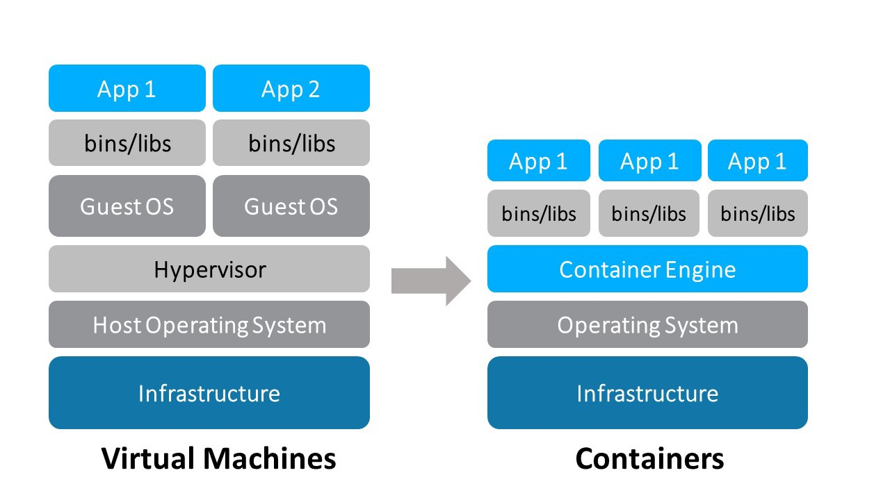

## Reproducible science with Docker

tl;dr: Dockerise your Jupyter workflow


<small>By [Kenneth Ho](https://aerymilts.github.io) / [Github](https://github.com/aerymilts/talks/tree/master/reproducible-science) </small>

---

### What this session is not

- A comprehensive rundown of Docker
- How to deploy with Docker
- Yet another magic bullet

---

### What this session is

- *Minimal* Docker knowledge to create reproducible notebooks

---

### Agenda

- How I used to work
- Intro to Docker: why and what is it
- Demo: My workflow and getting started

---

### My previous workflow

Conda environment + `yaml` files


note: because of conda recipes over pip; numpy speed up with intel MKL and OpenBLAS

--

### Caveats

1. The occasional pip
2. Recipes manages for a combination *now* 
3. Environment reproducibility sucks

note: 1. because recipe doesn't exist occasionally,  2. without consideration of preceding installed libraries' dependencies, 3. conda's env export does not port across OS, only works 100% for reinstalling on a snapshot of your OS

--

`conda env export > environment.yml`

```yml
name: py36
channels:
  - anaconda
  - cvxgrp
  - conda-forge
  - defaults
dependencies:
  - beautifulsoup4=4.6.3=py36_0
  - patsy=0.5.1=py36_0
  - sqlite=3.25.3=ha441bb4_0
  - tk=8.6.8=ha441bb4_0
  - asn1crypto=0.24.0=py36_1003
  - ca-certificates=2018.11.29=ha4d7672_0
  - certifi=2018.11.29=py36_1000
  - cffi=1.11.5=py36h5e8e0c9_1
  - clangdev=4.0.0=default_0
  - cryptography=2.3.1=py36hdbc3d79_1000
  - cryptography-vectors=2.3.1=py36_1000
  - cycler=0.10.0=py_1
  - fftw=3.3.8=h470a237_0
  - freetype=2.9.1=h6debe1e_4
  - glpk=4.65=h16a7912_1
  - gmp=6.1.2=hfc679d8_0
  - icu=58.2=h0a44026_1000
  - idna=2.8=py36_1000
  - kiwisolver=1.0.1=py36h2d50403_2
  - lapack=3.6.1=1
  - libiconv=1.15=h1de35cc_1004
  - libpng=1.6.35=ha92aebf_2
  - libxml2=2.9.8=hf14e9c8_1005
  - lightgbm=2.2.1=py36hfc679d8_0
  - llvmdev=4.0.0=default_0
  - matplotlib=2.2.3=py36h0e0179f_0
  - metis=5.1.0=3
  - mkl_fft=1.0.6=py36_0
  - mkl_random=1.0.1=py36_0
  - mlxtend=0.13.0=py_1
  - openblas=0.2.20=8
  - openmp=4.0.0=1
  - openssl=1.0.2p=h1de35cc_1002
  - pandas=0.23.4=py36hf8a1672_0
  - pycparser=2.19=py_0
  - pyopenssl=18.0.0=py36_1000
  - pyparsing=2.2.0=py_1
  - pysocks=1.6.8=py36_1002
  - python=3.6.6=h4a56312_1003
  - pytz=2018.5=py_0
  - selenium=3.141.0=py36h470a237_0
  - tbb=2018_20171205=0
  - urllib3=1.24.1=py36_1000
  - cvxcanon=0.1.1=py36_0
  - cvxpy=1.0.6=py36_0
  - ecos=2.0.5=py36hf9b3073_0
  - multiprocess=0.70.4=py36_0
  - scs=1.2.6=py36_0
  - appnope=0.1.0=py36hf537a9a_0
  - backcall=0.1.0=py36_0
  - blas=1.0=mkl
  - cvxopt=1.2.0=py36hb579ef3_0
  - decorator=4.3.0=py36_0
  - dill=0.2.8.2=py36_0
  - dsdp=5.8=hb579ef3_0
  - fastcache=1.0.2=py36h1de35cc_2
  - gsl=2.4=h1de35cc_4
  - intel-openmp=2019.0=117
  - ipykernel=4.8.2=py36_0
  - ipython=6.4.0=py36_0
  - ipython_genutils=0.2.0=py36h241746c_0
  - jedi=0.12.0=py36_1
  - jupyter_client=5.2.3=py36_0
  - jupyter_core=4.4.0=py36h79cf704_0
  - libcxx=4.0.1=h579ed51_0
  - libcxxabi=4.0.1=hebd6815_0
  - libedit=3.1.20170329=hb402a30_2
  - libffi=3.2.1=h475c297_4
  - libgcc=4.8.5=hdbeacc1_10
  - libgfortran=3.0.1=h93005f0_2
  - libopenblas=0.3.3=hdc02c5d_2
  - libsodium=1.0.16=h3efe00b_0
  - mkl=2018.0.3=1
  - ncurses=6.1=h0a44026_0
  - numpy=1.15.4=py36h6a91979_0
  - numpy-base=1.15.4=py36h8a80b8c_0
  - parso=0.2.1=py36_0
  - pexpect=4.6.0=py36_0
  - pickleshare=0.7.4=py36hf512f8e_0
  - pip=10.0.1=py36_0
  - prompt_toolkit=1.0.15=py36haeda067_0
  - ptyprocess=0.5.2=py36he6521c3_0
  - pygments=2.2.0=py36h240cd3f_0
  - python-dateutil=2.7.3=py36_0
  - pyzmq=17.0.0=py36h1de35cc_1
  - readline=7.0=hc1231fa_4
  - scikit-learn=0.20.1=py36h4f467ca_0
  - scipy=1.1.0=py36h28f7352_1
  - setuptools=39.2.0=py36_0
  - simplegeneric=0.8.1=py36_2
  - six=1.11.0=py36h0e22d5e_1
  - suitesparse=5.2.0=he235d88_0
  - toolz=0.9.0=py36_0
  - tornado=5.0.2=py36_0
  - traitlets=4.3.2=py36h65bd3ce_0
  - wcwidth=0.1.7=py36h8c6ec74_0
  - wheel=0.31.1=py36_0
  - xz=5.2.4=h1de35cc_4
  - zeromq=4.2.5=h378b8a2_0
  - zlib=1.2.11=hf3cbc9b_2
  - pip:
    - absl-py==0.2.2
    - astor==0.6.2
    - bleach==1.5.0
    - cython==0.28.3
    - gast==0.2.0
    - grpcio==1.12.1
    - h5py==2.8.0
    - html5lib==0.9999999
    - keras==2.2.0
    - keras-applications==1.0.2
    - keras-preprocessing==1.0.1
    - markdown==2.6.11
    - pillow==5.1.0
    - protobuf==3.5.2.post1
    - pyramid-arima==0.6.5
    - pyyaml==3.12
    - sklearn==0.0
    - statsmodels==0.9.0
    - tensorboard==1.8.0
    - tensorflow==1.8.0
    - termcolor==1.1.0
    - tqdm==4.23.4
    - werkzeug==0.14.1
    - xlrd==1.1.0
prefix: /Users/username/anaconda2/envs/py36
```

--

```bash
conda env create -f py36.yml
Collecting package metadata: done
Solving environment: failed

ResolvePackageNotFound: 
  - libgfortran==3.0.1=h93005f0_2
  - pyzmq==17.0.0=py36h1de35cc_1
  - python==3.6.6=h4a56312_1003
  - prompt_toolkit==1.0.15=py36haeda067_0
  - libiconv==1.15=h1de35cc_1004
  - sqlite==3.25.3=ha441bb4_0
  - six==1.11.0=py36h0e22d5e_1
  - cryptography==2.3.1=py36hdbc3d79_1000
  - openssl==1.0.2p=h1de35cc_1002
  - libxml2==2.9.8=hf14e9c8_1005
  - libcxxabi==4.0.1=hebd6815_0
  - matplotlib==2.2.3=py36h0e0179f_0
  - ptyprocess==0.5.2=py36he6521c3_0
  - readline==7.0=hc1231fa_4
  - libedit==3.1.20170329=hb402a30_2
  - libgcc==4.8.5=hdbeacc1_10
  - xz==5.2.4=h1de35cc_4
  - pickleshare==0.7.4=py36hf512f8e_0
  - appnope==0.1.0=py36hf537a9a_0
  - scipy==1.1.0=py36h28f7352_1
  - cvxopt==1.2.0=py36hb579ef3_0
  - jupyter_core==4.4.0=py36h79cf704_0
  - dsdp==5.8=hb579ef3_0
  - ncurses==6.1=h0a44026_0
  - tk==8.6.8=ha441bb4_0
  - ecos==2.0.5=py36hf9b3073_0
  - wcwidth==0.1.7=py36h8c6ec74_0
  - scikit-learn==0.20.1=py36h4f467ca_0
  - libopenblas==0.3.3=hdc02c5d_2
  - traitlets==4.3.2=py36h65bd3ce_0
  - libsodium==1.0.16=h3efe00b_0
  - ipython_genutils==0.2.0=py36h241746c_0
  - fastcache==1.0.2=py36h1de35cc_2
  - numpy==1.15.4=py36h6a91979_0
  - numpy-base==1.15.4=py36h8a80b8c_0
  - zlib==1.2.11=hf3cbc9b_2
  - libffi==3.2.1=h475c297_4
  - pygments==2.2.0=py36h240cd3f_0
  - icu==58.2=h0a44026_1000
  - gsl==2.4=h1de35cc_4
  - libcxx==4.0.1=h579ed51_0
  - suitesparse==5.2.0=he235d88_0
  - zeromq==4.2.5=h378b8a2_0
```

---

### Why Docker

- Eliminates dependency hell
- Lightweight
- Easy to ship

note: To be clear, I still use my conda workflow within the docker container

---

### What is Docker?



note: to simplify, you can think of docker virtualisation being similar to VMs. note that this is not technically accurate. the differences are essentially in the way virtualisation is implemented. virtualisation as a topic involves understanding how processors and machine language works (hardware to software).

--

#### How does it solve environment reproducibility?

- Docker engine
- Dockerfile
- Image
- Container

note: The engine is that virtualisation layer that powers the containerisation tech. there is a specific engine for each of the OSes. Dockerfile: instructions to generate image. Image: A template that is generated from instructions in Dockerfile. Container: Instance of an image, where you run an app or job.

--

### An analogy

soup recipe 📝 > pot of soup 🍲 > serving of soup 🥣

---

### My DS workflow with Docker

Dockerfile + `env_file` in project directory

--

### Dockerfile

```Dockerfile
FROM jupyter/tensorflow-notebook@sha256:a09c137aa9bb946224be6db9d03785a17f8946466065b29041ec9603c19fcdde
RUN conda install -yc conda-forge opencv && conda install -yc conda-forge pyqt
```

--

### Environment variables

```list
# Controlling container environment of Jupyter Docker Stacks docs - https://jupyter-docker-stacks.readthedocs.io/en/latest/using/common.html#docker-options
# for allowing HTTPS connections
GEN_CERT=yes
# lab enabled
JUPYTER_ENABLE_LAB=yes
# set numeric user id for joyvan, select a number that matches owner id of host volume
# NB_UID=1009
# to allow for installation of libraries during dev
# RESTARTABLE=yes
```

For WSL users: Set container's user id to match that of host volume {.fragment data-code-focus=7-7}

note: you will need to uncomment the line to adjust the user value

---

### Running docker images

```bash
docker build -t $IMAGE_NAME .
```

```bash
docker run -it --rm \
--name "$CONTAINER_NAME" \
-p 9999:8888 \
--env-file ./env.list \
-v $(pwd):/home/jovyan/work \
--user root \
"$IMAGE_NAME" \
start-notebook.sh --NotebookApp.token=''
```

The two commands I generally use {.fragment .current-only}

The first time you build an image {.fragment .current-only data-code-block=1 data-code-focus=1-1}

[`run`](https://docs.docker.com/engine/reference/run/) an interactive , pseudo-terminal (`-it`) and an [*ephemeral*](https://docs.docker.com/develop/develop-images/dockerfile_best-practices/#create-ephemeral-containers) (`--rm`) container {.fragment .current-only data-code-block=2 data-code-focus=1-1}

Docker specific commands: container and image name, publish port (localhost:container), current working dir {.fragment .current-only data-code-block=2 data-code-focus=2-3,5,7}

Jupyter docker stack-specific config: [environment list](https://jupyter-docker-stacks.readthedocs.io/en/latest/using/common.html#docker-options) (those on WSL may need to [set user permissions](#/7/2) by running with root user) {.fragment .current-only data-code-block=2 data-code-focus=4,6}

Script to start notebook. Authentication disabled. {.fragment .current-only data-code-block=2 data-code-focus=8}

> ⚠️ enable authentication if container is not isolated {.fragment .current-only data-code-block=2 data-code-focus=8}

note: 1. why ephemeral? 2. setting names of the container and image. host's port set to not collide with jupyter's default 3. remember to set a password if developing on a remote host

---

### Your turn

---

### Writing your own Dockerfile

- Find your project dir
- Copy my Dockerfile to it
- Find your image
[here](https://jupyter-docker-stacks.readthedocs.io/en/latest/using/selecting.html)
- Add your own `RUN` commands 

> protip 1: [chain operators](https://askubuntu.com/questions/334994/which-one-is-better-using-or-to-execute-multiple-commands-in-one-line) to prevent [layer bloat](https://www.datawire.io/not-engineer-running-3-5gb-docker-images/)

> protip 2: [freeze image version](https://stackoverflow.com/questions/55407999/docker-pulling-an-image-by-digest-that-internally-uses-a-tag) in Dockerfile by using image:digest

note: don't use frozen image for deployment because base image would not receive vulnerability patches

---

#### Advanced tidbit: docker-compose

- For configuring and starting multiple containers on the same host
- Pre-configured yaml config file
- Dockerfile + `docker run` command

> ⚠️ Requires rebuilding if Dockerfile changes

note: don't use docker compose or docker swarm for prod. use kubernetes instead. docker-compose up and down. 

---

### Resources

- [SWE: Things I Wish I Knew About Docker Before I Started Using It](https://twg.io/blog/things-i-wish-i-knew-about-docker-before-i-started-using-it/)

- [Docker's 'under the hood' in 2 minutes](https://youtu.be/nn54PqMAi4o)